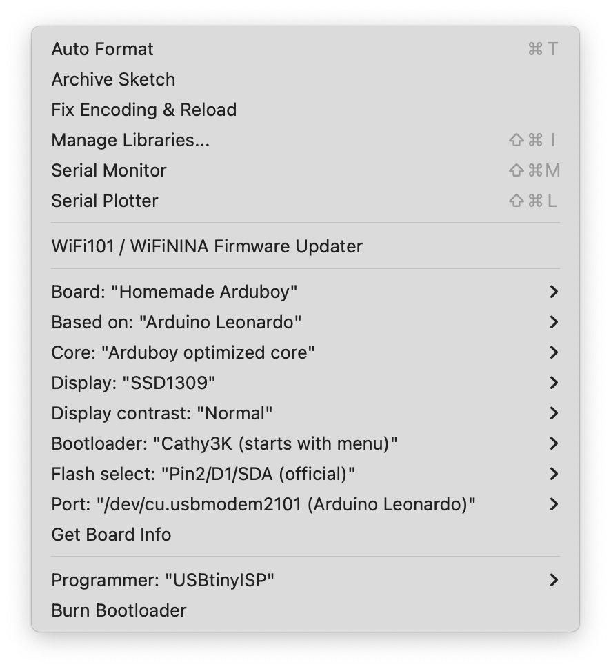
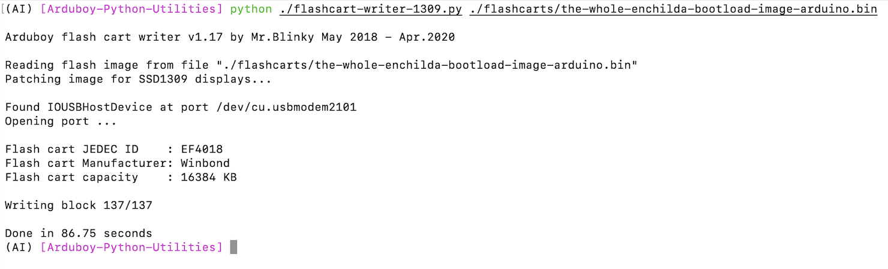

# Arduboy-Shield-FX

Arduboy 是一个 8-bit 开源游戏平台，它只使用简单的硬件就构建了一个非常有趣的软硬件生态系统。初代 Arduboy 由于直接采用了 ATMEGA32U4 所以程序空间十分有限，每次只能烧录一款游戏，虽然对于学习 C/C++ 和游戏开发来说已经足够了，但是社区中充满了拥有惊人技术和有趣的游戏，为了将它们随身携带，社区中出现了外挂 Flash Mod 的方案，随后官方采用了该方案并推出了 Arduboy FX。

对于我来说相比玩游戏，硬件是我更感兴趣的部分，正好 Arduino Leonardo 也是采用的 ATMEGA32U4，在搜索了一番之后，我决定自己制作一款基于 Leonardo 的 Shield，并命名为 Arduboy Shield FX。

⚠️警告：需要注意的是 Arduino Leonardo 和 Arduino UNO 看起来十分相似，但是 UNO 采用的是 328P，在内存上相比 Leonardo 小了 0.5kb，所以社区的游戏和下面提供的教程并不能直接运行。你需要把屏幕换成 IIC 并且对社区的游戏做一些移植工作，有关这个部分的资料你可以去 Arduboy 的社区看看。

## 硬件部分

目前的 0.0.4 版本已经打烊测试成功了，但仍然有一些已知的问题和改进空间：

1. 贴片 LED 采用的 1206，但大部分 Arduboy 社区的游戏并没有做 PWM 调光，这会导致亮度过高，建议不要焊
2. 蜂鸣器位置我是随便放的，有点不太讲究，如果改成贴片式蜂鸣器会更好一点
3. 没有设计电池，也就是说你只能插电使用

关于屏幕选型问题：

1. Arduboy Shield FX 支持使用 0.96、1.3 和 1.5 寸 SPI 接口的 OLED 模组
2. 1.3 寸 OLED 是平衡游玩体验和 Shield 观感最合适的屏幕，但是由于 SH1116 驱动的问题，现在社区大部分游戏在没有做移植的情况下会出现显示错误，当然开发自己的新游戏就没有无所谓了
3. 如果想直接游玩社区的游戏，还是推荐使用 0.96 或 1.5 寸 OLED

BOM：

| 名称 | 数量 | 说明 |
|---|---|---|
| OLED | 1 | 根据你自己的情况选择 0.96、1.3 或者 1.5，需要是 7P SPI 接口 |
| W25Q128 | 1 | 游戏就是装在这个里面 |
| TXB0108 | 1 | 电平转换器，不用这个 OLED 也能驱动，但是不太稳定，所以直接用了 8 通道，竟然比 4 通道反而便宜 |
| 0955 无源蜂鸣器 | 1 | 差分驱动还是挺响的，没有做开关，不过有些游戏内部可以关闭蜂鸣器，不喜欢可以不焊 |
| 1206 LED | 3 | 红绿蓝各一个，太亮了推荐不焊 |
| 6x6x5 静音按键 | 6 | 相比普通按键确实没声音了，手感虽然也不错，但是总觉得没有普通按键爽快 |
| Arduino Leonardo | 1 | 开发板本体，本项目就是为了这点醋包的饺子 |
| 1x40P 排针 | 2 | Leonardo 和 UNO 一样左右有排母，买 40P 自己按照尺寸撇断就行了 |
| 2x3P 排母 | 1 | 用于 AVR 单片机烧录 Bootloader |

## 软件部分

软件安装分为两个部分：

1. 首先是刷入专门针对 Arduboy 优化过并且支持从 Flash Cart 启动游戏的 B o o t lo a de r
2. 给 W25Q128 刷入游戏固件

### 刷写 Bootloader

刷 Bootloader 需要准备 **USBTinyISP** 或另外一块 **Arduino 开发板** 这里不多赘述，具体可以在网上很容易找到资料。

[MrBlinky](https://github.com/MrBlinky) 创建了 [Arduboy-homemade-package](https://github.com/MrBlinky/Arduboy-homemade-package) 项目，让刷写 Bootloader 非常容易，首先打开 Arduino IDE，在 Boards Manager 中添加：

```
https://raw.githubusercontent.com/MrBlinky/Arduboy-homemade-package/master/package_arduboy_homemade_index.json
```

然后在 **Tools > Boards > Board manager** 中搜索 **Arduboy Homemade package**，点击安装即可。

需要注意的是由于 Arduino IDE 2.x API 发生了一些变化，如果你发现安装完成之后 **Tools** 菜单下 **Board** 选择了 **Homemade Arduboy** 之后没有出现 **Programmer**，那你需要安装 Arduino IDE 1.x 版本来进行 Bootloader 的刷写工作。



按照这张图调整好参数，唯一需要调整的是 **Display** 选项，如果你使用的是 0.96 寸 OLED，那么就选择 **SSD1306**，1.3 寸选择 **SH1116**，1.5 寸选择 **SSD1309**。

都调整好后，点击 Burn Bootloader 等待刷机完成即可。

刷机完成后重新上电，你应该能在屏幕看见 **USB BOOT** 标志，说明刷机成功，接下来给 W25Q128 烧录游戏即可。

### 烧录游戏

下载游戏合集可以看社区的这一篇帖子 [Build your own Arduboy FX Cart Image](https://community.arduboy.com/t/build-your-own-arduboy-fx-cart-image/10395)，当然你也可以直接刷我给你准备的社区游戏合集，我把它放在了这里： [the-whole-enchilada.bin](./Software/Flash%20Cart/the-whole-enchilada.bin)

烧录游戏需要使用 [MrBlinky](https://github.com/MrBlinky) 创建的 [Arduboy-Python-Utilities](https://github.com/MrBlinky/Arduboy-Python-Utilities) Python 脚本，你需要先下载该脚本。

1. 烧录游戏需要先安装 Python 3：[https://www.python.org/downloads/](https://www.python.org/downloads/)
2. 安装 PySerial：``python -m pip install pyserial``
3. 安装 Pillow：``python -m pip install pillow``
4. 下载 [MrBlinky](https://github.com/MrBlinky) 写的 [Arduboy-Python-Utilities](https://github.com/MrBlinky/Arduboy-Python-Utilities) Python 脚本
5. 将刚才下载的游戏（ the-whole-enchilada.bin 文件 ）拷贝到 Arduboy-Python-Utilities 目录下
6. 将 Arduboy Shield FX 插在 Arduino Leonado 上面，然后连接电脑
7. 在 Arduboy-Python-Utilities 目录打开终端
8. 如果你是 0.96 寸 OLED 使用这个命令烧录游戏：``python flashcart-writer.py ./the-whole-enchilada.bin``
9. 如果你是 1.5 寸 OLED，那么首先把 ``flashcart-writer.py`` 文件更名为 ``flashcart-writer-1309.py``
10. 然后使用这个命令烧录游戏：``python flashcart-writer-1309.py ./the-whole-enchilada.bin``



当你看到 **Done** 的时候，烧录便完成了，这个时候重新上电你应该就能看到 Arduboy 的菜单界面了。

## 游戏推荐

- [Ardugolf](https://community.arduboy.com/t/ardugolf-18-hole-mini-golf/10462)

在 8 位单片机上实现了 3D 高尔夫游戏，实在是非常厉害，并且游戏本身也非常有意思。

- [Arduchess](https://community.arduboy.com/t/arduchess-play-chess-on-the-arduboy/9676)

Ardugolf 作者的另外一款游戏，在 8 位单片机上实现了完整的国际象棋 AI，虽然屏幕很小，但是代码很强。

- [Catacombs of the damned!](https://community.arduboy.com/t/catacombs-of-the-damned-formerly-another-fps-style-3d-demo/6565/)

一款 FPS 游戏，拥有爽快的射击手感和流畅的 3D 视觉效果，游戏本身没有太多剧情和关卡设计，但是玩起来很爽，可以当作街机游戏来玩。

- [MicroCity](https://community.arduboy.com/t/microcity-city-simulation-in-your-pocket/4808)

一款城市模拟游戏，在如此小巧的机器上玩城市模拟别有一番风味。

## 参考资料

社区：[Arduboy Community](https://community.arduboy.com/)

文档：[Arduboy Document](https://community.arduboy.com/t/library-documentation/7836)

Flash Cart：[Build your own Arduboy FX Cart Image](https://community.arduboy.com/t/build-your-own-arduboy-fx-cart-image/10395)

[MrBlinky](https://github.com/MrBlinky)：[Arduboy-homemade-package](https://github.com/MrBlinky/Arduboy-homemade-package)、[Arduboy-Python-Utilities](https://github.com/MrBlinky/Arduboy-Python-Utilities)

## 授权（ License ）

Arduino 和 Arduboy 是商标，它们的版权属于它们各自团队。

[Arduboy-homemade-package](https://github.com/MrBlinky/Arduboy-homemade-package) 和 [Arduboy-Python-Utilities](htvtps://github.com/MrBlinky/Arduboy-Python-Utilities) 使用它们自己的仓库标注的的协议。

Flash Cart 和游戏合集来自于社区，也是用它们自己的协议。

本项目 Reference 目录下面资料来源于 Arduboy，版权归 Arduboy 所有。

<a rel="license" href="http://creativecommons.org/licenses/by-nc-sa/4.0/"></a><br />本项目 Hardware 目录下的原理图和 Gerber<a rel="license" href="http://creativecommons.org/licenses/by-nc-sa/4.0/">知识共享署名-非商业性使用-相同方式共享 4.0 国际许可协议</a>进行许可，如果你需要商业授权请与我联系。
